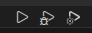
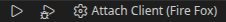
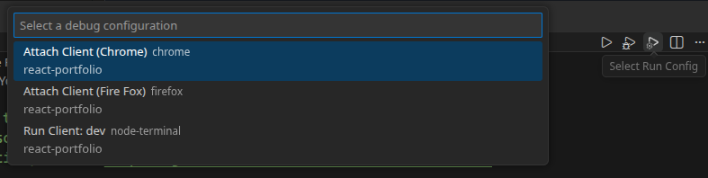
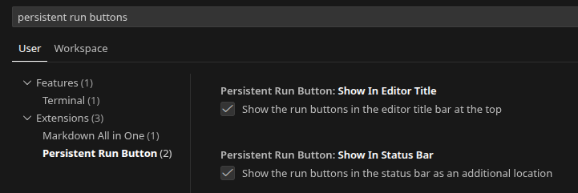

# persistent-run-buttonss README

This simple extension adds persistent buttons to the editor title bar and/or status bar to run or debug your project using the selected configuration from launchsettings.json. This allows for quick access to run or debug your project without needing to open the command palette, context menu, or side bar

## Features

- Adds run and debug buttons to the editor title bar:

- Adds run and debug buttons to the status bar:

- Switch between run profiles in launchsettings.json:

## Requirements

None

## Extension Settings

Available settings:

- UI:
  

- Customize where buttons appear using settings.json:
  - `persistentRunButton.showInEditorTitle`: Show buttons in the editor title bar.
  - `persistentRunButton.showInStatusBar`: Show buttons in the status bar.

## Known Issues

None

## Release Notes

### 1.0.0

- Initial release of persistent-run-buttons.

### 1.0.1

- Updated marketplace display name to "Persistent Run Buttons".

### 1.0.2

- Added compounds to run options
- Fixed issue with the editor title buttons being split up by other buttons (specifically the open changes button)

---
